# KS0551 4WD Mecanum Robot Car for Arduino


## Read me frist

 **Download the APP, Code and library from the link: <https://fs.keyestudio.com/KS0551>**

## 1. Description

When it comes to programming, many consider it difficult. However, KEYES group rolls out a 4WD Mecanum Robot kit to cope with this problem. This product not only allows your child to learn the knowledge of programming, but also electronics, mechanics, control logic and computer science.

This is a low-cost, easy-to-operate and open source programming kit. In fact, it is also simple to install and connect from complex electronics integrated into a backplate and a 2.54 anti-plug terminal, which solely need a few simple assembly steps to build your own Mecanum Robot car.

It contains an IR remote control, 7-color LEDs, RGB2812, a line tracking sensor, a servo, motors and Mecanum wheels, an ultrasonic module,etc.

Furthermore, the detailed projects will guide you to learn the working principle of sensors and modules.

There are 12 programming courses in this kit, which rang from simple to complex. If this can not meet your demand, you can seek to alter code and add extra modules to enrich the functions.

That sounds entertaining, right? Let’s get started!

## 2. Features

  1.Multi-purpose function: color light display, IR control, bluetooth control, universal wheel control, ultrasonic follow, ultrasonic obstacle avoidance,  4WD drive, car tracking, UNO PLUS control board, etc.

  2.Easy to build: Motor drive , RGB2812 and 7-color LEDs have been integrated  in the bottom plate above and without welding circuit.

  3.Novel style: We use the Mecanum wheels and the wirings between modules are simple. 

  4.High extension: Preserve IIC, UART, SPI, ESP8266WIFI and you can extend other sensors and modules. What’s more, the Matrix keyboard has a strong controllability.

  5.Basic programming learning：use C language and code.

## 3. Parameters

Input voltage：7-12V

Working voltage：5V

Maximum consumption power：15W

## 4. Kit list

|  \#  |                           Picture                            |                          Components                          | QTY  |
| :--: | :----------------------------------------------------------: | :----------------------------------------------------------: | :--: |
|  1   |       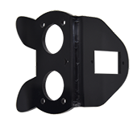       |                  MD0487 Acrylic Board T=3mm                  |  1   |
|  2   |       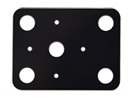       |             Acrylic Board with Lego Holes T=3mmm             |  1   |
|  3   |                                           |                         Motor Plate                          |  4   |
|  4   |                                           |                          4.5V Motor                          |  4   |
|  5   |              |                   23*15*5mm Fixing Board                     |  4   |
|  6   |          |                   DX-BT24 Bluetooth Module                   |  1   |
|  7   |      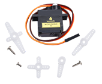       |                            Servo                             |  1   |
|  8   |                                          |                        Mecanum Wheels                        |  4   |
|  9   | 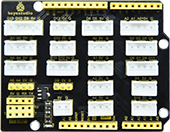              |           Keyestudio Sensor Shield V6 for Arduino            |  1   |
|  10  |               |                     Keyestudio UNO PLUS                      |  1   |
|  11  |       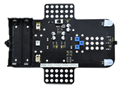        |         4WD Mecanum Robot Lower Board（with motor driver）    |  1   |
|  12  |             |               M3*15MM Dual-pass Copper Pillar                |  4   |
|  13  |             |                       4265c Lego Part                        |  4   |
|  14  |             |                       43093 Lego Part                        |  4   |
|  15  |             |                Acrylic Gasket Six in One Pack                |  1   |
|  16  |             |                   M3*6mm Flat Head Screw                     |  10  |
|  17  |               |                  HC-SR04 Ultrasonic Sensor                   |  1   |
|  18  |               |                   M3*8mm Flat Head Screw                     |  10  |
|  19  |             |                     M3 Nickle-plated Nut                     |  10  |
|  20  |             |                  M3*30mm Round Head Screw                    |  9   |
|  21  |             |                     M2 Nickle-plated Nut                     |  3   |
|  22  |             |                   M2*8mm Round Head Screw                    |  3   |
|  23  |               |                    M1.4 Nickle-plated Nut                    |  6   |
|  24  |             |                 M1.4*10mm Round Head Screw                   |  6   |
|  25  |             |                 M2.5*14mm Round Head Screw                   |  4   |
|  26  |             |              Remote Control (without batteries)              |  1   |
|  27  |             |                   Plastic String 3*100mm                     |  5   |
|  28  |               |                          USB Cable                           |  1   |
|  29  |              |                 HX-2.54 2P DuPont Wire 100mm                 |  1   |
|  30  |             |                 HX-2.54 5P DuPont Wire 100mm                 |  1   |
|  31  |      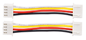       |                 HX-2.54 4P DuPont Wire 50mm                  |  2   |
|  32  |              |            HX2.54mm-4P to 2.54 DuPont Wire 150mm             |  1   |
|  33  |              |                  XH2.54 3P DuPont Wire 50mm                  |  3   |
|  34  |             |                     3*40mm Screwdriver                       |  1   |
|  35  |               |                         TT Coupling                          |  4   |
|  36  |      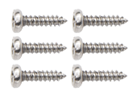       |           M1.2*5mm Round Head Self-tapping Screw             |  6   |

## 5. Getting started with Arduino

 **（1）Keyestudio UNO PLUS Development Board**

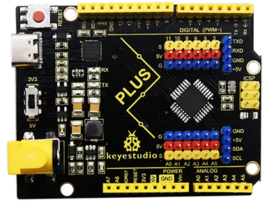

The core processor of the board is ATMEGA328P-AU, using a CP2102 chip as UART-to-USB converter. It has 14 digital input/output pins (of which 6 can be used as PWM outputs), 8 analog inputs, a serial port for communication, a 16 MHz crystal oscillator, a USB connection, a power jack, a ICSP plug as well as a reset button.

It supports everything you need for a microcontroller. You can connect it to your computer with a USB cable and power it through an external power connector (DC 7-12V) to start using it.

| Microcontroller      | ATMEGA328P-AU                                            |
| -------------------- | -------------------------------------------------------- |
| Operating Voltage    | 5V                                                       |
| Input Voltage        | DC7-12V                                                  |
| Digital I/O Pins     | 14个 (D0-D13)                                            |
| PWM Digital I/O Pins | 6个 (D3，D5，D6，D9，D10，D11)                           |
| Analog Input Pins    | 8个(A0-A7)                                               |
| Flash Memory         | 32 KB (ATMEGA328P-PU) of which 0.5 KB used by bootloader |
| SRAM                 | 2 KB (ATMEGA328P-PU)                                     |
| EEPROM               | 1 KB (ATMEGA328P-PU)                                     |
| Clock Speed          | 16 MHz                                                   |

**Element and Interfaces:**


**UNO PLUS Board and UNO Board**


 **（2）Installing the Arduino IDE**

When we get control board, we need to download Arduino IDE and driver firstly.

You could download Arduino IDE from the official website:

<https://www.arduino.cc/>, click the **SOFTWARE** on the browse bar, click“DOWNLOADS” to enter download page, as shown below:


You can download either Windows win7 and newer or Windows ZIP file.

There are two versions of IDE for WINDOWS system, you can choose from the Installer (.exe) and the Zip packages. We suggest you use the first one that installs directly everything you need to use the Arduino Software (IDE), including the drivers.

With the Zip package you need to install the drivers manually. The Zip file is also useful to create a portable installation.


You just need to click JUST DOWNLOAD.

 （3）Installing the driver

We will work to install the Keyes Uno Plus development board driver, whose USB serial port chip is CP2102. The ARDUINO development software 1.8 or above has included the driver of this chip, thereby, it is very convenient for us to use. When you plug in a USB, your computer will recognize the hardware and WINDOWS will automatically install the driver for the CP2102.

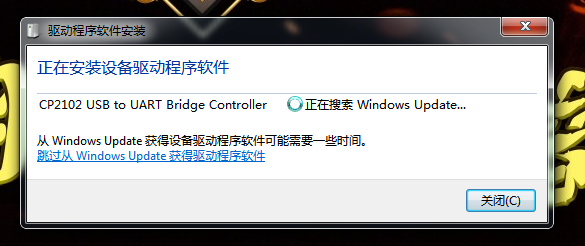

If the driver installation is not successful, or you want to install the driver manually, please open device manager on your computer.


If you see a yellow exclamation point, please double-click the hardware to update driver.


Find the ARDUINO software


Open the DIRVERS file to see the driver of the CP210X series chips


Select the file and click OK to install the driver successfully

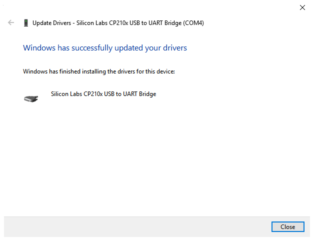

The driver for the CP2102 has been installed successfully


 （4）Interfaces for the expansion board:

The interface of motors, 7 color LEDs and RGB on the car are drawn out, we solely need a wire with anti-reverse plug terminal from the interface on the corresponding bottom plate, which is simple and convenient. In addition, we also reserved some interfaces, IIC, UART, and WIFI interface. It must be noted that this board is powered by the backplate 2PIN terminal 5V.


 （5）Driver Board

Note: The batteries should not be connected inversely

As you can see, we use an IR receiving head at both ends of the bottom board and they share a signal pin (the 7-color LED also share a signal pin), which is convenient to receive the infrared data we send from the remote control.

Furthermore, it integrates a motor driver, an IR receiving, a line tracking sensor as well as RGB2812.


 （6）Arduino IDE Setting

Click icon and open the Arduino IDE.


To avoid the errors when uploading the program to the board, you need to select the correct Arduino board that matches the board connected to your computer.


Then select the correct COM port (you can see the corresponding COM port after the driver is successfully installed).


A- Used to verify whether there is any compiling mistakes or not.

B- Used to upload the sketch to your Arduino board.

C- Used to create shortcut window of a new sketch.

D- Used to directly open an example sketch.

E- Used to save the sketch.

F- Used to send the serial data received from board to the serial monitor.

 （7）Start your first program

We learned how to download the software and install the driver for the development board. Next, we will burn a code to show “Hello World！”on the monitor.

**Test Code**

```c
void setup() {
  // initialize serial communication at 9600 bits per second:
  Serial.begin(9600);   
}

void loop() {
  // print out "Hello world!"
  Serial.println("Hello world!");
  delay(1000);// delay 1 second
}
```

Then let’s make monitor show Hello World！

Open Arduino IDE, and select **Arduino UNO**


Set COM port, as shown below:


Clickto start compiling the program, and check errors.

Clickto upload the program, upload successfully.


Upload the program successfully, open the serial monitor and set baud rate to 9600\. Monitor will print“Hello World!”each 1s.


## 6. Assembly Guide

 Part 1：

a. Components Needed                                                                                                                                                        b. Installation Diagram                                                                             c. Prototype                                                   

 Part 2：

a. Components Needed                                                                       b. Installation Diagram                                                                       c. Prototype                                                                  

 Part 3:

a. Components Needed                                                         b. Installation Diagram    c. Prototype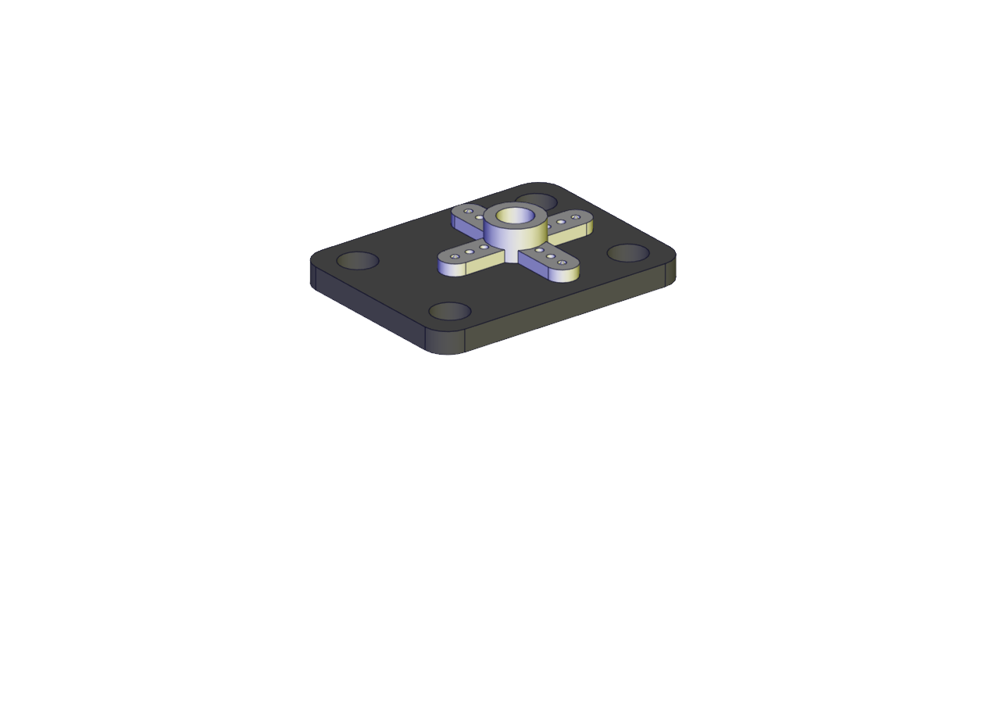 

 Part 4（adjust the angle of the servo first) :

a. Adjust the angle of the servo to 90 degrees according to the right picture

```c
#include <Servo.h>
Servo myservo;
      //Define a servo
  void
  setup() {
  myservo.attach(9);
        //The pin of the servo is connected to D9
    myservo.write(90);
      //Return to the 90 degree position
    delay(500);
}
void loop() {
}
```

b. Components Needed                                                                    c. Installation Diagram (mind the installation direction)                                                                   d. Prototype                                                                   

  Part 5:

a.  Components Needed                                                 b. Installation Diagram                                             c. Prototype                                             

 Part 6:

a. Components Needed                                             b. Installation Diagram                                              c. Prototype

 Part 7:

a. Components Needed                                             b. Installation Diagram (mind the direction of the motor)  c. Prototype  

 Part 8:

a. Components Needed                                                                   b. Installation Diagram (Pay attention to the installation direction of the mecanum wheel)                                                                                                                                                                                c. Prototype                                                                 

 Part 9:

a. Components Needed                                           b. Installation Diagram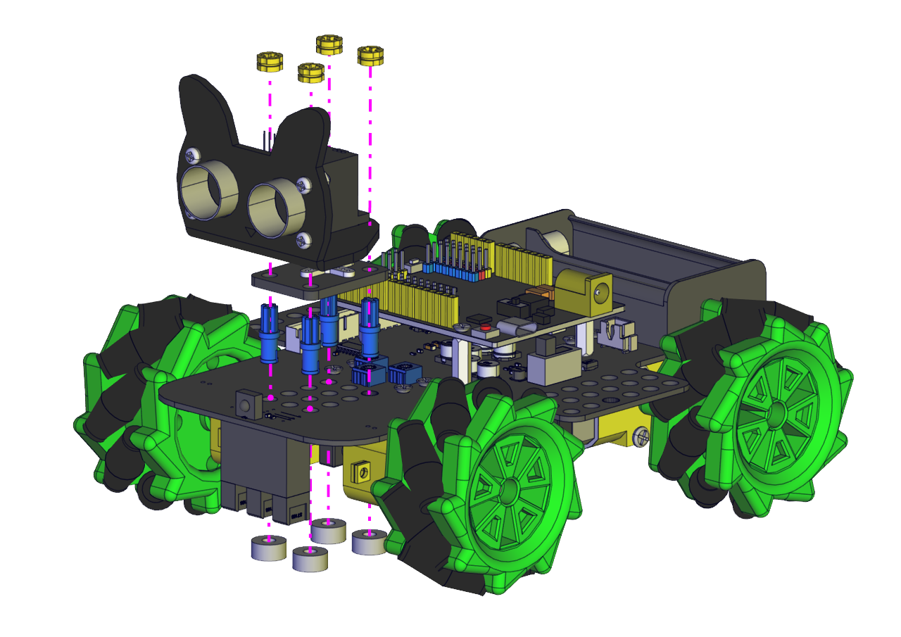                                           c. Prototype                                            

 Part 10:

a. Components Needed                                           b. Installation Diagram 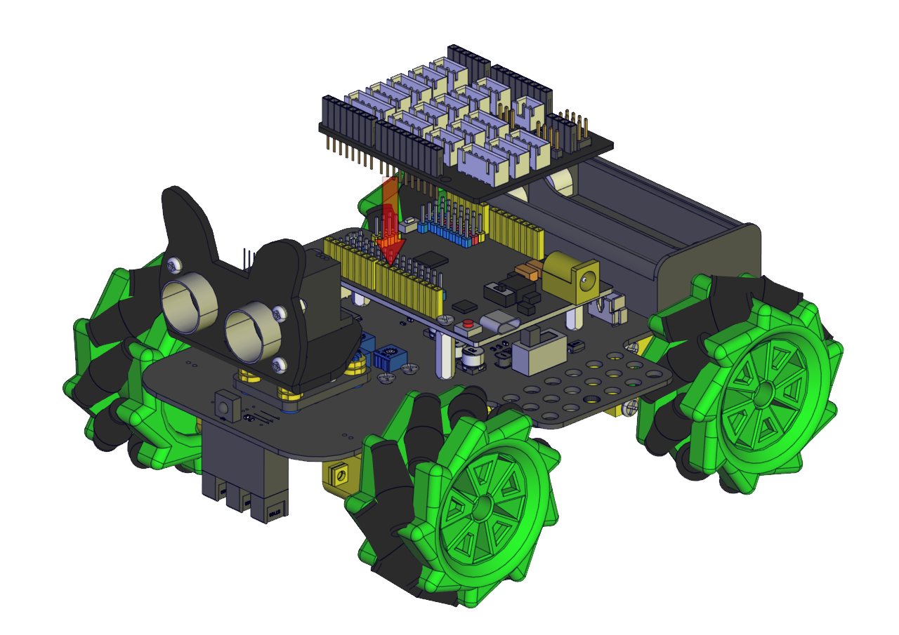                                           c. Prototype                                           

**Inserting a Bluetooth module correctly**                                                                                                                                                                        

 **Wiring Diagram**

The wiring of the ultrasonic module (ECHO pin is connected to 13，TRIG pin is connected to 12)                                                                                         

The wiring of the servo (The servo pin is connected to 9)                                                                                                                                                                                        

The wiring of the power (Power must be plugged into the 5V terminal)                                                                                                                                                                         

The wiring of the IR receiving sensor (The pin of the IR receiving sensor is connected to A4)                                                                                                                                                                        

The wiring of the RGB 2812 LED(The pin of the 2812 LED is connected to 10)                                                                                                                                                                        

The wiring of the 7-color LED (The pin of the 7-color LED is connected to A3)                                                                                                                                                                        

The wiring of the M3、M4 motor (D6D7D8D11)                                                                                                                                                                        

The wiring of the M1、M2 motor (D2D3D4D5)                                                                                                                                                                        

The wiring of the line-tracking sensor(The pin of the line-tracking sensor is connected to A0A1A2)                                                                                                                                                                         

Connect the motor to the corresponding interface as shown in the figure                                                                                                                                                                        

Installation of batteries (left“+”，right “-”)                                                                                                                                                                         

## 7.Projects

We're officially starting the Mecanum Robot Car programming projects. We will start with simple sensors as well as modules and complete the projects step by step. Then we will finally combine all the knowledge we learned to complete a comprehensive project: Bluetooth controls the car.

Note: (G), marked on each sensor and module, is negative pole and connected to“G”,“-”or“GND”on the sensor shield or control board ; (V) is positive pole and interfaced with“V”,“VCC”,“+”or“5V”on the sensor shield or control board.

### Project 1: 7-Color LED Blink


 **1.Description**

Earlier we introduced the hardware and installed the development board driver. Now, we will explore the world of Arduino step by step from simple to complex. First we're going to finish the classic Arduino lit LED. Here we will use 7-color LEDs, which are components with a white appearance and displays seven colors. This module is the same as the normal LED driver, which will automatically flash seven colors when we input high power and stop flashing when
input low power.

We have integrated 7-color LEDs into our motor drive board. In the first project, we will use a basic test code to control it to blink for 3 seconds, off for 1 second to achieve the control effect.

You can also change the time of the LEDs on and off in your code to achieve different duration effects. When in control, power on GND and VCC, the LEDs will be on if S end is high level; otherwise, it will go off.

 **2.Working Principle**

Control interface: Digit IO

Working voltage: DC 3.3-5V

Pin number: 2（long+，short -）

LED displays color：red，green，blue, cyan ，dark red ，yellow and white 7 colors flashing automatically


**Driver Control:** Each of the two 7-color LEDs uses an NPN triode driver. The control end is connected to the network "LED S1", which is connected to our microcontroller pin.

When we use the microcontroller (Arduino) to output a high level (5V) to this pin, both triodes will turn on, and there will be voltage at both ends of the 7-color LEDs and they will flash. On the contrary, when we use Arduino to output low level (0V) to this pin, both triodes turn off. At this time, there is no voltage at both ends of the two 7-color LEDs, thereby no flicker.

(The signal ends of the two 7-colored LEDs are connected to the A3 terminal of our expansion board.)

 **3.Test Code**

```c
/*
  Keyestudio 4WD Mecanum Robot for Arduino
  lesson 1
  Color LED
  http://www.keyestudio.com
*/
#define  LED   A3

void setup() {
  pinMode(LED, OUTPUT);// Configure 7-color LED pin mode for output
}

void loop() {
  digitalWrite(LED, HIGH);// Turn on the 7-color LED flash
  delay(5000);            // Delay 5000 ms

  digitalWrite(LED, LOW); // Turn off the 7-color LED flash
  delay(1000);            // Delay 1000 ms

}
```

 **4.Test Result**

Click upload the program and you will see the 7-color LEDs flash for 5 seconds, then go off for 1 second, and repeat.

 **5.Code Explanation**

**\#define LED A3**  - Pin definition

**pinMode(LED，OUTPUT)** - This function can denote that the pin is INPUT or OUTPUT.

**digitalWrite(LED，HIGH)** - When pin is OUTPUT, we can set it to HIGH(output 5V) or LOW(output 0V).

**delay() -** Delay function, in ms

### Project 2: WS2812 RGB

 1.Description


In this project, we will work to use WS2812 LED to display different colors. Its principle is different from the 7-color LED, we need a pin to control it. This is an intelligent external controlled LED light source integrating control circuit and light emitting circuit. The appearance of each LED is the same as that of a 5050 LED and each component is a pixel. There are four LEDs on our motor drive board, namely four pixels. Let's learn how to control it to display color.

 **2.Working Principle**

Control interface: Digit IO

Working voltage:DC 5V

Pin number:3（VCC，GND，S）

LED displays color：Any color

**Driver Control:** 

The four pixel LEDs are connected in series, and we can control any one of the LEDs with a pin and make it display any color. The pixel contains an intelligent digital interface data locking signal and amplifying driver circuit as well as a high-precision internal oscillator and a 12V high voltage programmable constant current control part, which effectively ensures the color consistency of the pixel light.

The data protocol adopts the communication mode of single-line return to zero code. After the pixel is powered on and reseted, the S terminal receives the data transmitted from the controller.

When the first 24bit data extracted by the first pixel, which will be sent to the data latch inside the pixel. This 6812RGB communication protocol and driver has been encapsulated in the bottom layer, we can directly call the interface function to use.


**RGB Color Setting：**


 **3.Test Code**

```c
/*
  Keyestudio 4WD Mecanum Robot for Arduino
  lesson 2.1
  RGB2812
  http://www.keyestudio.com
*/
#include <Adafruit_NeoPixel.h>

//Create a category named rgb_2812 to control 4 LEDs and the pins are connected to D10
Adafruit_NeoPixel rgb_2812 = Adafruit_NeoPixel(4, 10, NEO_GRB + NEO_KHZ800);

void setup() {
  rgb_2812.begin();   //Activate rgb2818
  rgb_2812.setBrightness(100);  //Set the initial brightness to 100,(0~255)
  rgb_2812.show();   //Initialize all NeoPixels to the closed state


  rgb_2812.setPixelColor(0, 255, 0, 0);//The first LED is bright red
  rgb_2812.setPixelColor(1, 0, 255, 0);//The second LED is bright green
  rgb_2812.setPixelColor(2, 0, 0, 255);//The third LED is bright blue
  rgb_2812.setPixelColor(3, 255, 255, 255);//The fourth LED is bright white
  rgb_2812.show();    //Refresh display 
}

void loop() {
}
```

 **4.Test Result**

After uploading successfully, we can see that the 4 LEDs below the driver baseplate are respectively bright red, green, blue and white.

 **5.Code Explanation**

**.begin();**  - We will use it to initialize RGB2812.

**.setBrightness(100);** - If the brightness value is not set, it will be the brightest by default. At this time, it may be too bright to make our eyes uncomfortable, thereby it is suggested to reduce the brightness, 0\~255, the larger the value, the brighter the LED will be.

**.show();** - Refresh Display. When we change the color or brightness of the LED, we must use this function again, otherwise the setting will not work.

**.setPixelColor(uint16_t n, uint8_t r, uint8_t g, uint8_t b)** - This function can make any LED display any color. It must be noted that the first parameter n is the RGB number to be set, the first LED number is 0. The following three parameters are RGB values to be set, ranging from 0 to 255 .

 **6.Extended Experiment**

We do not change the LED's position, rewrite an RGB water flowing LED, and make the color random to see their effect.

```c
/*
  Keyestudio 4WD Mecanum Robot for Arduino
  lesson 2.2
  RGB2812
  http://www.keyestudio.com
*/
#include <Adafruit_NeoPixel.h>

//Create a category named rgb_2812 to control 4 LEDs and the pins are connected to D10
Adafruit_NeoPixel rgb_2812 = Adafruit_NeoPixel(4, 10, NEO_GRB + NEO_KHZ800);

void setup() {
  rgb_2812.begin();   //Activate rgb2818
  rgb_2812.setBrightness(150);  //Initial brightness(0~255)
  rgb_2812.show();   //Initialize all NeoPixels to the closed state
}

void loop() {
  uint8_t r = random(0, 255);
  uint8_t g = random(0, 255);
  uint8_t b = random(0, 255);
  for (uint8_t i = 0; i < 4; i++)
  {
    rgb_2812.setPixelColor(i, r, g, b);//The color of the I +1 LED is random(r,g,b)
    rgb_2812.show();    //Refresh display
    delay(100); //Wait for a while
  }
}
```

Upload the code to the development board to see if the effect of 2812 is a little more cool.

### Project 3: Servo


 1.Description

For those DIY smart cars, they often have the function of automatic obstacle avoidance. In the DIY process, we need a servo to control the ultrasonic module to rotate left and right, and then detect the distance between the car and the obstacle, so as to control the car to avoid the obstacle.

If other microcontrollers are used to control the rotation of the servo, we need to set a certain frequency and a certain width of pulse to control the servo angle. But if arduino is used to control the servo angle, we only need to set the control angle in the development environment where the corresponding pulse will be automatically set to control the servo rotation. 

In this project, you will learn how to control the servo to rotate back and forth between 0° and 180°.

 **2.Working Principle**

**Angle range**：180°（There are 360°servo，180°servo，90°servo）

**Driver voltage**：3.3V or 5V

The pins are usually three wires


**GND**：This is a grounded pin, which is brown.

**VCC**：This is a pin connected to +5v（3.3V）power, which is red.

**S**：This is a pin controlled by PWM signal, which is orange.


**Control Principle:**

The rotation angle of servo is controlled by regulating the duty cycle of PWM (Pulse-Width Modulation) signal. The standard cycle of PWM signal is 20ms (50Hz). Theoretically, the width is distributed between 1ms-2ms, but in fact, it's between 0.5ms-2.5ms. The width corresponds to the rotation angle from 0° to 180°. But note that for different brand servo, the same signal may have different rotation angle. (The servo signal end is D9 pin connected to our expansion board)

 **3.Test Code1:Use handwritten pulse function to drive servo **

```c
/*
  Keyestudio 4WD Mecanum Robot for Arduino
  lesson 3.1
  Servo
  http://www.keyestudio.com
*/
#define  servo_pin  9      //The servo is connected to D9

void setup() {
  pinMode(servo_pin, OUTPUT);    //Set the servo pin mode to output
}

void loop() {
  for (uint8_t angle = 0; angle < 180; angle++)
  {
    servopulse(servo_pin, angle);
  }
  for (uint8_t angle = 180; angle > 0; angle--)
  {
    servopulse(servo_pin, angle);
  }
}

void servopulse(int pin, int myangle) {   //Impulse function 
  int pulsewidth = map(myangle, 0, 180, 500, 2500); //Map angle to pulse width
  //output pulse
  digitalWrite(pin, HIGH);        //Set the servo interface to a high level 
  delayMicroseconds(pulsewidth);  //Delay the number of ms of pulse width value
  digitalWrite(pin, LOW);         //Set the servo interface to a low level 
  delay(20 - pulsewidth / 1000);  //Cycle is 20 ms
}
```

 **4.Test Code2:Use the servo library to drive servo **

```c
/*
  Keyestudio 4WD Mecanum Robot for Arduino
  lesson 3.2
  Servo
  http://www.keyestudio.com
*/
#include <Servo.h>
Servo myservo;    //Define an instance of a servo

void setup() {
  myservo.attach(9);    //The pin of the servo is connected to D9 
}

void loop() {
  for (uint8_t angle = 0; angle < 180; angle++)//From 0 to 180 degrees
  {
    myservo.write(angle); //Rotate to angle  
    delay(15);  //Wait for a while 
  }
  for (uint8_t angle = 180; angle > 0; angle--)//From 180 to 0 degrees
    myservo.write(angle); //Rotate to angle
    delay(15);
  }
}
```

 **5.Test Result**

After uploading the test code, connect the wires of the servo and power up. The servo will rotate from 0 degrees to 180 degrees and then from 180 to 0 degrees. However, we will find it rotates faster and is more convenient to use when using the servo library to drive.

(Note: When we use the servo library file, the PWM output of D9 and D10 will fail, because they share the same timer 1 with the servo library.)

 **6.Code Explanation**

**servopulse(servo_pin, angle);**  - This function make the servo rotate to angle.

**map(myangle, 0, 180, 500, 2500);** - This is arduino's built-in mapping function, we can input variable myangle in one range and output the value corresponding to another range.

For example, the input variable ranges from 0 to 180 and the output ranges from 500 to 2500. If myangle is 0, then the output is 500. If myangle is 180, the output value is 2500; If myangle has a value of 90, the output value is 1500. This one-to-one mapping allows angle values from 0 to 180 to be mapped to pulse widths from 500 to 2500.

**delay(20 - pulsewidth / 1000);** - Here the pulsewidth is us, thereby we have to divide by 1,000 to get ms. The driver cycle of the servo is 20ms, thereby 20 is used to subtract the pulse width (which can be understood as high level ), and the low level can be set for the rest of the cycle.

**myservo.attach(9);** - This function is to set the pin to which our servo is connected. We input 9.

**myservo.write(angle);**- This function makes the servo rotate to angle position.

### Project 4: Motor


 **1.Description**

The Keyestudio 4WD Mecanum Robot Car is equipped with 4 DC reduction motors, which are developed on the ordinary DC motors. It has a matching gear reduction box which provides a lower speed but a larger torque. Furthermore, different reduction ratios of the box can provide different speeds and torques.

Gear motor is the integration of gearmotor and motor, which is applied widely in steel and machine industry.

The current of the motor driver is relatively large. If we use the IO port to force the motor to drive, either the motor will not rotate or the IO port will be burned, thereby it entails a motor driver chip. The DRV8833 motor driver chip has been included on the motor drive baseplate, which is used to control the rotation direction and speed of the 4 DC reduction motors. The circuit schematic diagram of the two chips are as below:


Each chip controls 4 pins, and 2 pins control one motor.

 **2.Parameters and Principle**

Motor type：F130SA-11200-38V

Operating voltage：DC 3-6V

Rated voltage：DC 4.5V

No-load current：≤80mA

No-load speed: About 200 RPM measured 180 RPM

Reduction gear ratio：1:48

**Direction**

|                       | **Right Front M1 Motor**        | **Right Rear M4 Motor**        | **Left Front M2 Motor**        | **Left Rear M3 Motor**           |
| --------------------- | ------------------------------- | ------------------------------ | ------------------------------ | -------------------------------- |
| **Advance**           | M1Rotates clockwise (LOW)       | M4 Rotates clockwise (LOW)     | M2 Rotates clockwise (LOW)     | M3 Rotates clockwise (LOW)       |
| **Move Back**         | M1 Rotates anticlockwise (HIGH) | M4 Rotates anticlockwise(HIGH) | M2 Rotates anticlockwise(HIGH) | M3Rotates anticlock wise(HIGH)   |
| **Rotate Left**       | M1Rotates clockwise (LOW)       | M4 Rotates clockwise(LOW)      | M2 Rotates clockwise (HIGH)    | M3Rotates anticlock wise(HIGH)   |
| **Rotate Right**      | M1 Rotates anticlockwise (HIGH) | M4 Rotates anticlockwise(HIGH) | M2 Rotates clockwise (LOW)     | M3 Rotates clockwise (LOW)       |
| **Left Translation**  | M1Rotates clockwise (LOW)       | M4 Rotates anticlockwise(HIGH) | M2 Rotates anticlockwise(HIGH) | M3 Rotates clockwise (LOW)       |
| **Right Translation** | M1 Rotates anticlockwise (HIGH) | M4 Rotates clockwise (LOW)     | M2 Rotates clockwise (LOW)     | M3Rotates anticlock wise(HIGH)   |
| **Left Front Move**   | M1 Rotates clockwise (LOW)      | M4 Stop                        | M2 Stop                        | M3 Rotates Clockwise  (LOW)      |
| **Left Rear Move**    | M1 Stop                         | M4 Rotates anticlockwise(HIGH) | M2 Rotates anticlockwise(HIGH) | M3 Stop                          |
| **Right Front Move**  | M1 Stop                         | M4 Rotates clockwise (LOW)     | M2 Rotates clockwise (LOW)     | M3 Stop                          |
| **Right Rear Move**   | M1 Rotates anticlockwise (HIGH) | M4 Stop                        | M2 Stop                        | M3 Rotates anticlock wise (HIGH) |
| **Stop**              | M1 Stop                         | M4 Stop                        | M2 Stop                        | M3 Stop                          |

 **3.Test Code1: Control the forward and reverse rotation of a motor**

```c
/*
  Keyestudio 4WD Mecanum Robot for Arduino
  lesson 4.1
  Motor
  http://www.keyestudio.com
*/

/****JM1Motor controls pins***/
#define PWM1  3 //Speed control pin
#define M1    2 //Direction control pin


void setup() {
  /****Set all motor control pins to output mode***/
  pinMode(M1, OUTPUT);
  pinMode(PWM1, OUTPUT);
}

void loop() {
  digitalWrite(M1, LOW);  //Motor rotates clockwise
  analogWrite(PWM1, 100); //Set the speed
  delay(2000);  //Wait for 2 seconds
  
  digitalWrite(M1, LOW);
  analogWrite(PWM1, 0); //Stop when the speed is 0
  delay(1000);
  
  digitalWrite(M1, HIGH);  //Motor rotates counterclockwise
  analogWrite(PWM1, 100);  //Set the speed
  delay(2000);

  digitalWrite(M1, LOW);
  analogWrite(PWM1, 0); //Stop when the speed is 0
  delay(1000);
}
```


 **4.Test Code2: Control 4 motors**

```c
/*
  Keyestudio 4WD Mecanum Robot for Arduino
  lesson 4.2
  Motor
  http://www.keyestudio.com
*/

/****JM1Motor controls pins***/
#define PWM1  3
#define M1    2
/****JM4Motor controls pins***/
#define PWM4  11
#define M4    8

/****JM2Motor controls pins***/
#define PWM2  5
#define M2    4
/****JM3Motor controls pins***/
#define PWM3  6
#define M3    7


uint8_t speed1 = 100;  //Right front motor speed
uint8_t speed4 = 100;  //Right rear motor speed

uint8_t speed2 = 100; //Left front motor speed
uint8_t speed3 = 100; //Left rear motor speed


void setup() {
  /****All motor control pins are set to output mode***/
  pinMode(M1, OUTPUT);
  pinMode(PWM1, OUTPUT);
  pinMode(M2, OUTPUT);
  pinMode(PWM2, OUTPUT);
  pinMode(M3, OUTPUT);
  pinMode(PWM3, OUTPUT);
  pinMode(M4, OUTPUT);
  pinMode(PWM4, OUTPUT);

}

void loop() {
  Advance();  //The car advance
  delay(2000);
  Back();     //The car moves back
  delay(2000);
  Turn_Left();  //The car turns left
  delay(2000);
  Turn_Right(); //The car turns right
  delay(2000);
  Stop();     //The car stops
  delay(1000);
}

/**********The car advance***********/
void Advance(void) {
  digitalWrite(M1, LOW);
  analogWrite(PWM1, speed1);
  digitalWrite(M4, LOW);
  analogWrite(PWM4, speed4);
  
  digitalWrite(M2, LOW);
  analogWrite(PWM2, speed2);
  digitalWrite(M3, LOW);
  analogWrite(PWM3, speed3);
}

/**********The car moves back***********/
void Back(void) {
  digitalWrite(M1, HIGH);
  analogWrite(PWM1, 255 - speed1);
  digitalWrite(M4, HIGH);
  analogWrite(PWM4, 255 - speed4);
  
  digitalWrite(M2, HIGH);
  analogWrite(PWM2, 255 - speed2);
  digitalWrite(M3, HIGH);
  analogWrite(PWM3, 255 - speed3);
}

/**********The car rotates left***********/
void Turn_Left(void) {
  digitalWrite(M1, LOW);
  analogWrite(PWM1, speed1);
  digitalWrite(M4, LOW);
  analogWrite(PWM4, speed4);
  
  digitalWrite(M2, HIGH);
  analogWrite(PWM2, 255 - speed2);
  digitalWrite(M3, HIGH);
  analogWrite(PWM3, 255 - speed3);
}

/**********The car rotates right***********/
void Turn_Right(void) {
  digitalWrite(M1, HIGH);
  analogWrite(PWM1, 255 - speed1);
  digitalWrite(M4, HIGH);
  analogWrite(PWM4, 255 - speed4);
  
  digitalWrite(M2, LOW);
  analogWrite(PWM2, speed2);
  digitalWrite(M3, LOW);
  analogWrite(PWM3, speed3);
}

/**********The car stops***********/
void Stop(void) {
  digitalWrite(M1, LOW);
  analogWrite(PWM1, 0);
  digitalWrite(M2, LOW);
  analogWrite(PWM2, 0);
  digitalWrite(M3, LOW);
  analogWrite(PWM3, 0);
  digitalWrite(M4, LOW);
  analogWrite(PWM4, 0);
}
```

 **5.Test Result**

**Code1 Result：**The motor on the right front rotates clockwise for 2 s, stops for 1 s, anticlockwise for 2 s, and repeats.

**Code2 Result：**The car goes forward for 2 seconds, goes back for 2 s, turns left for 2 s, turns right for 2 s and then stops for 1 s.

 **6.Code Explanation**

**digitalWrite(Mx, LOW/HIGH);**  - This function sets the direction of rotation of the motor.

**analogWrite(PWMx, speed);**  - This function sets the duty cycle of the PWM output (from 0 to 255).

(Note: Since the speed control pins used by the right motor are D3 and D11, the frequency of these two PWM outputs are about 0.5khz. However, the PWM output frequency of D5 and D6 motors used on the left is about 1KHz. Due to the difference in frequency, there may be some difference in motor speed when we set the same speed, thereby we will make speed compensation in the code later to make their speed as same as possible.)

### Project 5: Line Tracking Sensor

 **1.Description**


The line tracking sensor is actually an infrared sensor. There are 3-channel line tracking in front of the car driving bottom plate, and the component used here is TCRT5000 IR tube. It works by using the different reflectance of IR light on colors and then converting the intensity of the reflected signal into an electric current signal.

Black is active at high voltage, while white is active at low voltage when detecting. The detection height is 0-3 cm. There are three blue rotating potentiometers to adjust the detection sensitivity of the sensor.

 **2.Working Principle**

Working voltage: 3.3-5V (DC)

Interface: 5PIN interface (connect to A0,A1,A2)

Output signal: Digital signals

Height detection: 0-3 cm

Before testing, rotate the potentiometer on the sensor to adjust the detection sensitivity. The sensitivity is best when the LED is adjusted to a threshold between ON and OFF.

**Principle:** It works by using the different reflectance of IR ray oncolors and then converting the intensity of the reflected signal into an electric current signal. When powering on, the diode emits IR light. FB- is the potentiometer, adjusting it can get a threshold voltage for the 4, 6 and 8 pins of the voltage comparator LM393. The voltage value can be determined according to the actual situation.

When infrared diode receives the infrared light, they will generate a current, and as the infrared light changes from weak to strong, the current increases from small to large. However, when there is no infrared light or it is very weak, the output signal is close to VCC.

After passing the LM393 comparator, the receiving detection pin outputs a high level. When the light intensity and the current increase, the output voltage will become smaller, when it is small to a certain extent, the pin will become low level.

Furthermore, if black or no object is detected, the signal end of the MCU will receive a high level. While a white object is detected, a low level will be received.


 **3.Test Code**

```c
/*
  Keyestudio 4WD Mecanum Robot for Arduino
  lesson 5
  Line Tracking Sensor
  http://www.keyestudio.com
*/
/*******Define the pin of Line Tracking Sensor**********/
#define SensorLeft    A0   //input pin of left sensor
#define SensorMiddle  A1   //input pin of middle sensor
#define SensorRight   A2   //input pin of right sensor


void setup() {
  Serial.begin(9600); //Start the serial monitor and set baud rate to 9600
  /****All Line Tracking Sensor interface are set to input mode***/
  pinMode(SensorLeft, INPUT);
  pinMode(SensorMiddle, INPUT);
  pinMode(SensorRight, INPUT);

}

void loop() {
  uint8_t SL = digitalRead(SensorLeft); //Read the value of the left Line Tracking Sensor
  uint8_t SM = digitalRead(SensorMiddle); //Read the value of the intermediate Line Tracking Sensor
  uint8_t SR = digitalRead(SensorRight); //Read the value of the right Line Tracking Sensor
    if (SM == HIGH) {
  Serial.print("Left:");  //Serial port prints the information  
  Serial.print("  Middle:");
  Serial.print(SM);
  Serial.print("  Right:");
  Serial.print(SR);
  Serial.println(); //Line feed
line feed
line feed
  delay(100);
}
```

 **4.Test Result**

After downloading the program to the experimental development board, open the serial monitor and set baud rate to 9600. If the line tracking sensor does not detect any object, the output signal is high level, that is, 1. When we use a white object for occlusion, the output signal becomes low, that is, 0.


 5.Code Explanation

**pinMode(SensorPin, INPUT);  -** Here we set singlechip to input mode.

**digitalRead(pin);** - We use this function to read the level signal of the corresponding pin, which can only be 0 and 1.

**Serial.print();** - We use the corresponding variables to store the read signal, and then print it out through the serial port. 

**Serial.print()**; for non-newline printing. **Serial.println()**;for newline printing.


### Project 6: Line Tracking Smart Car


 **1.Description**

In this lesson we will make a line tracking smart car. It works to use a line tracking sensor to detect the black track of the road, and the road surface detection signal is fed back to the control board. The control board analyzes and judges the collected signals, and timely controls the driving motor to adjust the steering of the car, making the car run automatically along the black track to realize the purpose of automatic tracking of the car.

 **2.Working Principle**


 **3.Test Code**

```c
/*
  Keyestudio 4WD Mecanum Robot for Arduino
  lesson 6
  Line Tracking Robot
  http://www.keyestudio.com
*/

/****JM1Motor controls pins***/
#define PWM1  3
#define M1    2
/****JM4Motor controls pins***/
#define PWM4  11
#define M4    8

/****JM2Motor controls pins***/
#define PWM2  5
#define M2    4
/****JM3Motor controls pins***/
#define PWM3  6
#define M3    7

/*******Define the pin of Line Tracking Sensor**********/
#define SensorLeft    A0   //input pin of left sensor
#define SensorMiddle  A1   //input pin of middle sensor
#define SensorRight   A2   //input pin of right sensor

uint8_t speed1 = 100;  //Right front motor speed
uint8_t speed4 = 100;  //Right rear motor speed

uint8_t speed2 = 100; //Left front motor speed
uint8_t speed3 = 100; //Left rear motor speed

void setup() {
  Serial.begin(9600); //Start the serial monitor and set baud rate to 9600
  /****All motor control pins are set to output mode***/
  pinMode(M1, OUTPUT);
  pinMode(PWM1, OUTPUT);
  pinMode(M2, OUTPUT);
  pinMode(PWM2, OUTPUT);
  pinMode(M3, OUTPUT);
  pinMode(PWM3, OUTPUT);
  pinMode(M4, OUTPUT);
  pinMode(PWM4, OUTPUT);
  /****All Line Tracking Sensor interface are set to input mode***/
  pinMode(SensorLeft, INPUT);
  pinMode(SensorMiddle, INPUT);
  pinMode(SensorRight, INPUT);

}

void loop() {
  uint8_t SL = digitalRead(SensorLeft);   //Read the value of the left Line Tracking Sensor
  uint8_t SM = digitalRead(SensorMiddle); //Read the value of the left Line Tracking Sensor
  uint8_t SR = digitalRead(SensorRight);  //Read the value of the right Line Tracking Sensor
    if (SM == HIGH) {
  if (SM == HIGH) {
    if (SL == LOW && SR == HIGH) {  // black on right, white on left, turn right
      Turn_Right();
    }
    else if (SR == LOW && SL == HIGH) {  // black on left, white on right, turn left
      Turn_Left();
    }
    else {  // white on both sides, going forward
      Advance();
    }
  }
  else {
    if (SL == LOW && SR == HIGH) { // black on right, white on left, turn right
      Turn_Right();
    }
    else if (SR == LOW && SL == HIGH) {  // white on right, black on left, turn left
      Turn_Left();
    }
    else { // all white, stop
      Stop();
    }
  }
}


/**********The car advance***********/
void Advance(void) {
  digitalWrite(M1, LOW);
  analogWrite(PWM1, speed1);
  digitalWrite(M4, LOW);
  analogWrite(PWM4, speed4);

  digitalWrite(M2, LOW);
  analogWrite(PWM2, speed2);
  digitalWrite(M3, LOW);
  analogWrite(PWM3, speed3);
}

/**********The car muves back***********/
void Back(void) {
  digitalWrite(M1, HIGH);
  analogWrite(PWM1, 255 - speed1);
  digitalWrite(M4, HIGH);
  analogWrite(PWM4, 255 - speed4);

  digitalWrite(M2, HIGH);
  analogWrite(PWM2, 255 - speed2);
  digitalWrite(M3, HIGH);
  analogWrite(PWM3, 255 - speed3);
}

/**********The car rotates left***********/
void Turn_Left(void) {
  digitalWrite(M1, LOW);
  analogWrite(PWM1, speed1);
  digitalWrite(M4, LOW);
  analogWrite(PWM4, speed4);

  digitalWrite(M2, HIGH);
  analogWrite(PWM2, 255 - speed2);
  digitalWrite(M3, HIGH);
  analogWrite(PWM3, 255 - speed3);
}

/**********The car rotates right***********/
void Turn_Right(void) {
  digitalWrite(M1, HIGH);
  analogWrite(PWM1, 255 - speed1);
  digitalWrite(M4, HIGH);
  analogWrite(PWM4, 255 - speed4);

  digitalWrite(M2, LOW);
  analogWrite(PWM2, speed2);
  digitalWrite(M3, LOW);
  analogWrite(PWM3, speed3);
}

/**********The car stops***********/
void Stop(void) {
  digitalWrite(M1, LOW);
  analogWrite(PWM1, 0);
  digitalWrite(M2, LOW);
  analogWrite(PWM2, 0);
  digitalWrite(M3, LOW);
  analogWrite(PWM3, 0);
  digitalWrite(M4, LOW);
  analogWrite(PWM4, 0);
}
```

 **4.Test Result**

After uploading the test code successfully, power up and the smart car will drive along the black line.

Note: 

(1) The width of the black line must be greater than or equal to the width of the 2-channel tracking sensor module, the car speed should be reduced as much as possible.

(2) When testing the car, do not under the sun. If problems occur, choose a darker environment.

### Project 7: Ultrasonic Sensor 


 **1.Description**

The ultrasonic sensor uses sonar to determine distance to an object like bats do. It offers excellent non-contact range detection with high accuracy and stable readings in an easy-to-use package. It comes complete with ultrasonic transmitter and receiver modules.

The ultrasonic sensor is being used in a wide range of electronics projects for creating obstacle detection and distance measuring application as well as various other applications.

In this project, we will work to show simple ways for distance with arduino and the ultrasonic sensor, and learn how to use the sensor in arduino.

 **2.Parameters and Principle**

- Working voltage:+5V DC

- Quiescent current: \<2mA

- Working current: 15mA

- Sensing angle: \<15°

- Distance range: 2cm – 400 cm

- Precision: 0.3 cm

- Measuring angle: 30 degree

- Input trigger pulse: 10us


**Principle**

The ultrasonic transmitter emits ultrasonic waves in a certain direction, and the counter starts timing at the same time of the launch. The ultrasonic wave spreads in the air and is immediately reflected back when encountering obstacles on the way.

When it stops timing immediately, the ultrasonic wave is also a sound wave whose speed V is related to temperature. Generally, the transmission speed of the wave in the air is 340m/s. According to the time t recorded by the timer, the distance s from the launching point to the obstacle surface can be calculated, that is, 
$$
S =340t/2
$$
a. Pull down TRIG then trigger high level signals with least 10us;

b. After triggering, the module will automatically send eight 40KHz ultrasonic pulses and detect whether there is a signal return;

c. If there is a signal return, ECHO outputs a high level, the high level read by the microcontroller time duration is the time of the ultrasonic wave from transmitting to returning.

 **3.Test Code**

```c
/*
  Keyestudio 4WD Mecanum Robot for Arduino
  lesson 7
  Ultrasonic sensor
  http://www.keyestudio.com
*/

/*******Ultrasonic Sensor interface*****/
#define EchoPin  13  //ECHO to D13
#define TrigPin  12  //TRIG to D12

void setup() {
  Serial.begin(9600); //Set baud rate to 9600
  pinMode(EchoPin, INPUT);    //The ECHO pin is set to input mode
  pinMode(TrigPin, OUTPUT);   //The TRIG pin is set to output mode
}

void loop() {
  float distance = Get_Distance();  //Get the distance and save in the distance variable  
  Serial.print("ditance:");
  Serial.print(distance);
  Serial.println("cm");
  delay(100);
}

float Get_Distance(void) {    //Ultrasonic detects the distance
  float dis;
  digitalWrite(TrigPin, LOW);
  delayMicroseconds(2);
  digitalWrite(TrigPin, HIGH); //Give the TRIG a high level of at least 10 µ s to trigger
  delayMicroseconds(10);
  digitalWrite(TrigPin, LOW);
  dis = pulseIn(EchoPin, HIGH) /58.2;  //Work out the distance
  delay(50);
  return dis;
}
```

 **4.Test Result**

After uploading the test code successfully, open the serial monitor and set the baud rate to 9600, the monitor will display the distance between the ultrasonic sensor and the obstacle, in cm, as shown in the following figure.


 5.Code Explanation

**pulseIn(EchoPin, HIGH) /58;**  - This code is used to calculate the distance between the ultrasonic and the obstacle. pulseIn (EchoPin, HIGH) calculates the time between the sound wave's emission and its reflection.

The time is t (us), the total distance back and forth is s=v\*t. V is the speed of sound waves in air, which is 340m/s (we need to convert it into cm and us when calculating). Distance = S /2 = V \* T /2 = (T \*34000/1000000)/2 = T *0.017 = T /58 (cm).

### Project 8: Ultrasonic Following Smart Car


 **1.Description**

In this project, we will work to combine ultrasonic sensor with motors to make an automatic follow smart car.

The ultrasonic sensor detects the smart car and the obstacle distance to control the motion status of car.

 **2.Working Principle**


 **3.Test Code**

```c
/*
  Keyestudio 4WD Mecanum Robot for Arduino
  lesson 8
  Ultrasonic follow Robot
  http://www.keyestudio.com
*/
#include <Servo.h>
Servo myservo;    //Define an instance of a servo


/****JM1Motor controls pins***/
#define PWM1  3
#define M1    2
/****JM4Motor controls pins***/
#define PWM4  11
#define M4    8

/****JM2Motor controls pins***/
#define PWM2  5
#define M2    4
/****JM3Motor controls pins***/
#define PWM3  6
#define M3    7

/*******Ultrasonic Sensor interface*****/
#define EchoPin  13  //ECHO to D13
#define TrigPin  12  //TRIG to D12

uint8_t speed1 = 100;  //Right front motor speed
uint8_t speed4 = 100;  //Right rear motor speed


uint8_t speed2 = 100; //Left front motor speed
uint8_t speed3 = 100; //Left rear motor speed

void setup() {
  Serial.begin(9600); //Set baud rate to 9600
  myservo.attach(9);    //The pins of the servo are connected to D9
  /****All motor control pins are set to output mode***/
  pinMode(M1, OUTPUT);
  pinMode(PWM1, OUTPUT);
  pinMode(M2, OUTPUT);
  pinMode(PWM2, OUTPUT);
  pinMode(M3, OUTPUT);
  pinMode(PWM3, OUTPUT);
  pinMode(M4, OUTPUT);
  pinMode(PWM4, OUTPUT);
  pinMode(EchoPin, INPUT);    //The ECHO pin is set to input mode
  pinMode(TrigPin, OUTPUT);   //The TRIG pin is set to output mode
  myservo.write(90); //Rotate to 90 degrees
  delay(100);
}

void loop() {
  float distance = Get_Distance();  ///Get the distance and save in the distance variable  
  if (distance >= 20 && distance <= 40) //The range of advance
  {
    Advance();
  }
  else if (distance > 10 && distance < 20)  //The range of stop
  {
    Stop();
  }
  else if (distance <= 10)  //The range of moving back
  {
    Back();
  }
  else  //Other cases stop
  {
    Stop();
  }
}

float Get_Distance(void) {    //Ultrasonic detects the distance
  float dis;
  digitalWrite(TrigPin, LOW);
  delayMicroseconds(2);
  digitalWrite(TrigPin, HIGH); //Give the TRIG a high level of at least 10 µ s to trigger
  delayMicroseconds(10);
  digitalWrite(TrigPin, LOW);
  dis = pulseIn(EchoPin, HIGH) / 58.2; //Work out the distance
  delay(50);
  return dis;
}

/**********The car advance ***********/
void Advance(void) {
  digitalWrite(M1, LOW);
  analogWrite(PWM1, speed1);
  digitalWrite(M4, LOW);
  analogWrite(PWM4, speed4);

  digitalWrite(M2, LOW);
  analogWrite(PWM2, speed2);
  digitalWrite(M3, LOW);
  analogWrite(PWM3, speed3);
}

/**********The car muves back***********/
void Back(void) {
  digitalWrite(M1, HIGH);
  analogWrite(PWM1, 255 - speed1);
  digitalWrite(M4, HIGH);
  analogWrite(PWM4, 255 - speed4);

  digitalWrite(M2, HIGH);
  analogWrite(PWM2, 255 - speed2);
  digitalWrite(M3, HIGH);
  analogWrite(PWM3, 255 - speed3);
}

/**********The car rotates left***********/
void Turn_Left(void) {
  digitalWrite(M1, LOW);
  analogWrite(PWM1, speed1);
  digitalWrite(M4, LOW);
  analogWrite(PWM4, speed4);

  digitalWrite(M2, HIGH);
  analogWrite(PWM2, 255 - speed2);
  digitalWrite(M3, HIGH);
  analogWrite(PWM3, 255 - speed3);
}

/**********The car rotates right***********/
void Turn_Right(void) {
  digitalWrite(M1, HIGH);
  analogWrite(PWM1, 255 - speed1);
  digitalWrite(M4, HIGH);
  analogWrite(PWM4, 255 - speed4);

  digitalWrite(M2, LOW);
  analogWrite(PWM2, speed2);
  digitalWrite(M3, LOW);
  analogWrite(PWM3, speed3);
}

/**********The car stops***********/
void Stop(void) {
  digitalWrite(M1, LOW);
  analogWrite(PWM1, 0);
  digitalWrite(M2, LOW);
  analogWrite(PWM2, 0);
  digitalWrite(M3, LOW);
  analogWrite(PWM3, 0);
  digitalWrite(M4, LOW);
  analogWrite(PWM4, 0);
}
```

 **6.Test Result**

After uploading the test code successfully, the servo will rotates to 90° and moves with the the movement of obstacles in front.

Note: The obstacles can solely move in front of the car, which can not turn.

### Project 9: Ultrasonic Avoidance Smart Car


 **1.Description**

Ultrasonic avoidance smart car is used to control the car motion state, so as to achieve obstacle avoidance by using the ultrasonic sensor detecting the obstacles distance.

 **2.Working Principle**


 **3.Test Code**

```c
/*
  Keyestudio 4WD Mecanum Robot for Arduino
  lesson 9
  Ultrasonic obstacle avoidance Robot
  http://www.keyestudio.com
*/
#include <Servo.h>
Servo myservo;    //Define an instance of a servo

/****JM1Motor controls pins***/
#define PWM1  3
#define M1    2
/****JM4Motor controls pins***/
#define PWM4  11
#define M4    8

/****JM2Motor controls pins***/
#define PWM2  5
#define M2    4
/****JM3Motor controls pins***/
#define PWM3  6
#define M3    7

/*******Ultrasonic Sensor interface*****/
#define EchoPin  13  //ECHO to D13
#define TrigPin  12  //TRIG to D12

uint8_t speed1 = 100;  //Right front motor speed
uint8_t speed4 = 100;  //Right rear motor speed

uint8_t speed2 = 100; //Left front motor speed
uint8_t speed3 = 100; //Left rear motor speed

float distance_M, distance_L, distance_R;
void setup() {
  Serial.begin(9600); //Set baud rate to 9600
  myservo.attach(9);    //The pins of the servo are connected to D9
  /****All motor control pins are set to output mode***/
  pinMode(M1, OUTPUT);
  pinMode(PWM1, OUTPUT);
  pinMode(M2, OUTPUT);
  pinMode(PWM2, OUTPUT);
  pinMode(M3, OUTPUT);
  pinMode(PWM3, OUTPUT);
  pinMode(M4, OUTPUT);
  pinMode(PWM4, OUTPUT);
  pinMode(EchoPin, INPUT);    //The ECHO pin is set to input mode
  pinMode(TrigPin, OUTPUT);   //The TRIG pin is set to output mode
  myservo.write(90); //Rotate to 90 degrees
  delay(100);
}

void loop() {
  distance_M = Get_Distance();  //Get the distance and save in the distance variable  
  if (distance_M < 20) {//When the distance in front is less than 20cm
    Stop();  //Robot stop
    delay(500); //Delay 500ms
    myservo.write(180);  //Ultrasonic cradle head turns left
    delay(500); //Delay 500ms
    distance_L = Get_Distance();  //Assign the left ultrasonic distance to variable a1
    delay(100); //Read values when stable
    myservo.write(0); //ltrasonic cradle head turns right
    delay(500); //Delay 500ms
    distance_R = Get_Distance(); //Assign the right ultrasonic distance to variable a2
    delay(100); //Read values when stable

    myservo.write(90);  //Return to the 90 degree position
    delay(500);
    if (distance_L > distance_R) { //When the distance on the left is greater than right
      Turn_Left();  //Robot turns left
      delay(300);  //Turn left 700 ms
    } else {
      Turn_Right(); //Robot turns right
      delay(300);
    }
  }
  else { //If the distance in front is >=20cm, the robot will advance
    Advance(); //advance
  }
}

float Get_Distance(void) {    //Ultrasonic detects the distance
  float dis;
  digitalWrite(TrigPin, LOW);
  delayMicroseconds(2);
  digitalWrite(TrigPin, HIGH); //Give the TRIG a high level of at least 10 µ s to trigger
  delayMicroseconds(10);
  digitalWrite(TrigPin, LOW);
  dis = pulseIn(EchoPin, HIGH) / 58.2; //Work out the distance
  delay(50);
  return dis;
}

/**********The car advance ***********/
void Advance(void) {
  digitalWrite(M1, LOW);
  analogWrite(PWM1, speed1);
  digitalWrite(M4, LOW);
  analogWrite(PWM4, speed4);

  digitalWrite(M2, LOW);
  analogWrite(PWM2, speed2);
  digitalWrite(M3, LOW);
  analogWrite(PWM3, speed3);
}

/**********The car muves back***********/
void Back(void) {
  digitalWrite(M1, HIGH);
  analogWrite(PWM1, 255 - speed1);
  digitalWrite(M4, HIGH);
  analogWrite(PWM4, 255 - speed4);

  digitalWrite(M2, HIGH);
  analogWrite(PWM2, 255 - speed2);
  digitalWrite(M3, HIGH);
  analogWrite(PWM3, 255 - speed3);
}

/**********The car rotates left***********/
void Turn_Left(void) {
  digitalWrite(M1, LOW);
  analogWrite(PWM1, speed1);
  digitalWrite(M4, LOW);
  analogWrite(PWM4, speed4);

  digitalWrite(M2, HIGH);
  analogWrite(PWM2, 255 - speed2);
  digitalWrite(M3, HIGH);
  analogWrite(PWM3, 255 - speed3);
}

/**********The car rotates right***********/
void Turn_Right(void) {
  digitalWrite(M1, HIGH);
  analogWrite(PWM1, 255 - speed1);
  digitalWrite(M4, HIGH);
  analogWrite(PWM4, 255 - speed4);

  digitalWrite(M2, LOW);
  analogWrite(PWM2, speed2);
  digitalWrite(M3, LOW);
  analogWrite(PWM3, speed3);
}

/**********The car stops***********/
void Stop(void) {
  digitalWrite(M1, LOW);
  analogWrite(PWM1, 0);
  digitalWrite(M2, LOW);
  analogWrite(PWM2, 0);
  digitalWrite(M3, LOW);
  analogWrite(PWM3, 0);
  digitalWrite(M4, LOW);
  analogWrite(PWM4, 0);
}
```

 **4.Test Result**

The car moves forward when the distance from the obstacle in front is greater than or equal to 20cm. On the contrary, the ultrasonic rotates to the left and right to measure the distance. If the left distance is bigger than the right, the car turns left, otherwise turns right.

### Project 10: IR Remote Control


 **1.Description**

There is no doubt that the IR remote control can be seen everywhere in our daily life, which is used to control a variety of appliances, including TVS, stereos, VCRS and satellite receivers.

It is composed of an infrared remote control and an infrared receiving module and a single chip microcomputer can decode.

The infrared receiving module mainly consists of an infrared receiving head, which is a device integrating reception, amplification and demodulation. Its internal IC can complete all the work from the infrared receiving output compatible with TTL level signal and the output is digital signal.

The infrared receiving module made by the receiver has solely three pins, signal line (the infrared receiving is connected with the A4 pin of the single chip microcomputer), VCC and GND. It is distinctly convenient to connect and communicate with arduino and other microcontrollers.

In this project, we will seek to print the key values of the IR remote control on the serial monitor.

 **2.Working Principle**

The 38KHz carrier signal transmitted by the IR remote control is encoded by the coding chip in the remote, which is (NEC protocol) composed of a series of  preamble code, user code, user inverse code, data code as well as data inverse code.

The time interval of the pulses is used to distinguish between 0 and 1 signals (560us low +560us high is signal 0, 560us low +1680us high is signal 1), and the code is composed of these 0 and 1 signals.

The user code of the same remote control is unchanged, and the key pressed by the remote control can be distinguished by the data difference.

When pressing the key , the remote control sends out the infrared carrier signal. When the infrared receiving obtains the signal, the program decodes the signal and determines which key is pressed.

The MCU is decoded by the received 01 signal to determine which key to press. In order to facilitate the reception of data, we have mounted the IR receiving heads on the car.


 **3.Test Code**

```c
/*
  Keyestudio 4WD Mecanum Robot for Arduino
  lesson 10
  IRremote
  http://www.keyestudio.com
*/

/****JM1Motor controls pins***/
#include <IRremoteTank.h>

int RECV_PIN = A4;
IRrecv irrecv(RECV_PIN);
decode_results results;

void setup()
{
  Serial.begin(9600);
  // In case the interrupt driver crashes on setup, give a clue
  // to the user what's going on.
  Serial.println("Enabling IRin");
  irrecv.enableIRIn(); // Start the receiver
  Serial.println("Enabled IRin");
}

void loop() {
  if (irrecv.decode(&results)) {
    Serial.println(results.value, HEX);
    irrecv.resume(); // Receive the next value
  }
  delay(100);
}
```

 **4.Test Result**

After uploading the test code successfully, open the serial monitor and set the baud rate to 9600. Send signals with the remote control to the IR receiving sensor to see the key value of the corresponding button. If the button is pressed for a long time, garbled characters may appear.


 **5.Code Explanation**

**irrecv.enableIRIn();** When infrared decoding is enabled, IRrecv objects will receive infrared signals in the background. Then you can use the decode() function to continuously check to see if the decode succeeded.

**irrecv.decode(&results);** If the decoding succeeds, this function returns true and places the result in results. After decoding an infrared signal, resume() will run to continue receiving the next set of signals.

### Project 11: IR Remote Control Smart Car


 **1.Description**

In this project, we will work to control the car using an IR remote control.

 **2.Working Principle**

| Initial setting                                  | The servo angle is 90°                  |                                        |
| ------------------------------------------------ | --------------------------------------- | -------------------------------------- |
|                                                  | 8X16 LED LED board displays "V" pattern |                                        |
| Infrared buttons                                 | The key value                           | The status of the corresponding button |
|   | 0xFF629D                                | Move forward                           |
| : | 0xFFA857                                | Move back                              |
| : | 0xFF22DD                                | Turn left                              |
|   | 0xFFC23D                                | Turn right                             |
| : | 0xFF02FD                                | Stop                                   |
| : | 0xFF30CF                                | Left translation                       |
|   | 0xFF7A85                                | Right translation                      |
| : | 0xFF6897                                | Upper left move                        |
|   | 0xFF10EF                                | Lower left move                        |
| : | 0xFFB04F                                | Upper right move                       |
| : | 0xFF5AA5                                | Lower right move                       |

 **3.Test Code**

```c
/*
  Keyestudio 4WD Mecanum Robot for Arduino
  lesson 11
  IRremote Control Robot
  http://www.keyestudio.com
*/

/****Introduce IR Remote Control header file***/
#include <IRremoteTank.h>

int RECV_PIN = A4;
IRrecv irrecv(RECV_PIN);
decode_results results;

/****JM1Motor controls the pins***/
#define PWM1  3
#define M1    2
/****JM4Motor controls the pins***/
#define PWM4  11
#define M4    8

/****JM2Motor controls the pins***/
#define PWM2  5
#define M2    4
/****JM3Motor controls the pins***/
#define PWM3  6
#define M3    7

/******** Speed compensation30***********/
#define speed1   100          //Righr front motor speed
#define speed4   100          //Righr rear motor speed

#define speed2   (speed1+30)  //Left front motor speed
#define speed3   (speed4+30)  //Left rear motor speed

void setup()
{
  Serial.begin(9600);
  /****All motor control pins are set to output mode***/
  pinMode(M1, OUTPUT);
  pinMode(PWM1, OUTPUT);
  pinMode(M2, OUTPUT);
  pinMode(PWM2, OUTPUT);
  pinMode(M3, OUTPUT);
  pinMode(PWM3, OUTPUT);
  pinMode(M4, OUTPUT);
  pinMode(PWM4, OUTPUT);
  // In case the interrupt driver crashes on setup, give a clue
  // to the user what's going on.
  irrecv.enableIRIn(); // Start the receiver
}

void loop() {
  if (irrecv.decode(&results)) {
    switch (results.value)
    {
      case 0xFF629D: Advance(); break;//
      case 0xFFA857: Back();    break;//
      case 0xFF22DD: Turn_Left();  break;//
      case 0xFFC23D: Turn_Right(); break;//
      case 0xFF02FD: Stop();    break;//OK
      case 0xFF30CF: L_Move(); break;//4
      case 0xFF7A85: R_Move(); break;//6
      case 0xFF6897: LU_Move(); break;//1
      case 0xFF10EF: LD_Move(); break;//7
      case 0xFFB04F: RU_Move(); break;//3
      case 0xFF5AA5: RD_Move(); break;//9
      default: break;
    }
    irrecv.resume(); // Receive the next value
  }

}

/**********The car advance***********/
void Advance(void) {
  digitalWrite(M1, LOW);
  analogWrite(PWM1, speed1);
  digitalWrite(M4, LOW);
  analogWrite(PWM4, speed4);

  digitalWrite(M2, LOW);
  analogWrite(PWM2, speed2);
  digitalWrite(M3, LOW);
  analogWrite(PWM3, speed3);
}

/**********The car moves back***********/
void Back(void) {
  digitalWrite(M1, HIGH);
  analogWrite(PWM1, 255 - speed1);
  digitalWrite(M4, HIGH);
  analogWrite(PWM4, 255 - speed4);

  digitalWrite(M2, HIGH);
  analogWrite(PWM2, 255 - speed2);
  digitalWrite(M3, HIGH);
  analogWrite(PWM3, 255 - speed3);
}

/**********The car rotates left***********/
void Turn_Left(void) {
  digitalWrite(M1, LOW);
  analogWrite(PWM1, speed1);
  digitalWrite(M4, LOW);
  analogWrite(PWM4, speed4);

  digitalWrite(M2, HIGH);
  analogWrite(PWM2, 255 - speed2);
  digitalWrite(M3, HIGH);
  analogWrite(PWM3, 255 - speed3);
}

/**********The car rotates right***********/
void Turn_Right(void) {
  digitalWrite(M1, HIGH);
  analogWrite(PWM1, 255 - speed1);
  digitalWrite(M4, HIGH);
  analogWrite(PWM4, 255 - speed4);

  digitalWrite(M2, LOW);
  analogWrite(PWM2, speed2);
  digitalWrite(M3, LOW);
  analogWrite(PWM3, speed3);
}

/**********The car stops***********/
void Stop(void) {
  digitalWrite(M1, LOW);
  analogWrite(PWM1, 0);
  digitalWrite(M2, LOW);
  analogWrite(PWM2, 0);
  digitalWrite(M3, LOW);
  analogWrite(PWM3, 0);
  digitalWrite(M4, LOW);
  analogWrite(PWM4, 0);
}

/**********The car moves on the left***********/
void L_Move(void) {
  digitalWrite(M1, LOW);
  analogWrite(PWM1, speed1);
  digitalWrite(M4, HIGH);
  analogWrite(PWM4, 255 - speed4);

  digitalWrite(M2, HIGH);
  analogWrite(PWM2, 255 - speed2);
  digitalWrite(M3, LOW);
  analogWrite(PWM3, speed3);
}


/**********The car moves on the right***********/
void R_Move(void) {
  digitalWrite(M1, HIGH);
  analogWrite(PWM1, 255 - speed1);
  digitalWrite(M4, LOW);
  analogWrite(PWM4, speed4);

  digitalWrite(M2, LOW);
  analogWrite(PWM2, speed2);
  digitalWrite(M3, HIGH);
  analogWrite(PWM3, 255 - speed3);
}

/**********The car moves on the left front***********/
void LU_Move(void) {
  digitalWrite(M1, LOW);
  analogWrite(PWM1, speed1);
  digitalWrite(M4, LOW);
  analogWrite(PWM4, 0);

  digitalWrite(M2, LOW);
  analogWrite(PWM2, 0);
  digitalWrite(M3, LOW);
  analogWrite(PWM3, speed3);
}


/**********The car moves on the left rear***********/
void LD_Move(void) {
  digitalWrite(M1, LOW);
  analogWrite(PWM1, 0);
  digitalWrite(M4, HIGH);
  analogWrite(PWM4, 255 - speed4);

  digitalWrite(M2, HIGH);
  analogWrite(PWM2, 255 - speed2);
  digitalWrite(M3, LOW);
  analogWrite(PWM3, 0);
}


/**********The car moves on the right front***********/
void RU_Move(void) {
  digitalWrite(M1, LOW);
  analogWrite(PWM1, 0);
  digitalWrite(M4, LOW);
  analogWrite(PWM4, speed4);

  digitalWrite(M2, LOW);
  analogWrite(PWM2, speed2);
  digitalWrite(M3, LOW);
  analogWrite(PWM3, 0);
}


/**********The car moves on the right rear***********/
void RD_Move(void) {
  digitalWrite(M1, HIGH);
  analogWrite(PWM1, 255 - speed1);
  digitalWrite(M4, LOW);
  analogWrite(PWM4, 0);

  digitalWrite(M2, LOW);
  analogWrite(PWM2, 0);
  digitalWrite(M3, HIGH);
  analogWrite(PWM3, 255 - speed3);
}
```


 **4.Test Result**

Uploading the test code and powering up. Align the IR remote control with the IR receiving head of the expansion board, pressing the corresponding button to control the movement of the car.

 **5.Code Explanation**

**switch(results.value){case ....};**  - The value of the result.value argument determines which line of code to execute, matching from after case until the break termination statement appears.

### Project 12: Bluetooth Control Smart Car


 **1.Description**

There is a DX-BT24 5.0 Bluetooth module in this kit. This bluetooth module comes with 256Kb space and complies with V5.0BLE bluetooth specification, which supports AT commands. Users can change parameters such as the baud rate and device name of the serial port as required.

Furthermore, it supports UART interface and bluetooth serial port transparent transmission, which also contains the advantages of low cost, small size, low power consumption and high sensitivity for sending and receiving. Notably, it solely needs a few peripheral components to realize its powerful functions.

In this project, we will use the BT24 bluetooth module to combine all modules of the car in one code, which contains all functions except IR remote control mentioned in the previous projects. We plan to use mobile APP to connect bluetooth module, so as to control various functions, which is distinctly simple and convenient.

We will work to introduce the installation and use of the APP as well as the functions of each button on the APP interface, and read the control characters sent by each button through the bluetooth connection of the APP.

 **2.APP Installation and Introduction**

**Apple system mobile APP download method**

a. Open the App Store.

b. Click on search to search for mecanum robot，then click“”to download the APP.

c. After downloading the APP, click "OPEN" or click the APP Mecanum_robot on the desktop of mobile phone /iPad to open the APP. A dialog box appears on the APP interface, then click "OK" .

d\. First turn on the bluetooth of the phone /iPad, and then click the connect button (control) in the upper right corner of the APP interface to search for bluetooth. After a few seconds, the bluetooth will be connected. (Note: Location permissions need to be turned on when we connect bluetooth pairing)

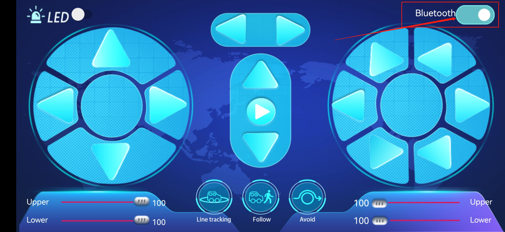

Find "BT24" in the search results and click "Connect" :


After the connection is complete. “Is Connected:” will be displayed as follows:


**Android mobile phone APP download method**

Search for mecanum Robot on Google Play or download: <http://8.210.52.206/mecanum_robot.apk>


Click "Allow allow" to enter the installation interface. Click "Install" to install the Mecanum_robot application.


Click "Open" or click the application mecanum_robot to open the APP, and a dialog box appears. Click "Allow" in the dialog box to open the bluetooth of the mobile phone. You can also turn on your phone's bluetooth before opening the APP.


Click the icon above, enter the APP and select TANK ROBOT, then enable the "Location and Bluetooth" permission. Connect the bluetooth pairing, as shown below, scan the bluetooth devices, bluetooth BLE 4.0 is named HMSoft, which have not a pairing password.

Click thebutton (control) in the upper right corner of the APP interface to search for the bluetooth. Click "Connect" in the "BCC micro: bit" dialog box in the Bluetooth search result. After a few seconds, the bluetooth connection is successful, and the bluetooth LED turns on.

After the APP is installed, let's test the code together: The bluetooth module must be unplugged before the code is uploaded, and it can be plugged in after uploading, otherwise the code may not be burned, and we need to open the positioning when we connect the Bluetooth.

 **3.Test Code1: Read the control characters of the APP**

(Do not connect the bluetooth module before uploading the code）

Upload the code to the development board, and then plug in the bluetooth module.

```c
/*
  Keyestudio 4WD Mecanum Robot for Arduino
  lesson 12.1
  APP Test
  http://www.keyestudio.com
*/

void setup() {
  Serial.begin(9600);//Start the serial monitor and set the baud rate to 9600
}

void loop() {
  if (Serial.available())//If the receiving area is not empty
  {
    char ble_val = Serial.read();//Read the data of the bluetooth
    Serial.println(ble_val);//The serial monitor prints the read data
  }
}
```

After uploading the code, plug in the bluetooth, be careful not to plug it upside down. Connect the bluetooth module and turn on the serial monitor and set baud rate to 9600.

Aim at the bluetooth module and press the APP button of the mobile phone. We can see the corresponding control characters of the APP button, as shown below.


 **4.Test Code2: APP controls the smart car**

```c
/*
  Keyestudio 4WD Mecanum Robot for Arduino
  lesson 12.2
  APP Control Robot
  http://www.keyestudio.com
*/

#include <Adafruit_NeoPixel.h>
#include <Servo.h>
Servo myservo;    //Define an instance of a servo

//Create a category named rgb_2812 to control 4 LEDs and the pins are connected to D10
Adafruit_NeoPixel rgb_2812 = Adafruit_NeoPixel(4, 10, NEO_GRB + NEO_KHZ800);

/*******Define the pin of Line Tracking Sensor**********/
#define SensorLeft    A0   //input pin of left sensor
#define SensorMiddle  A1   //input pin of middle sensor
#define SensorRight   A2   //input pin of right sensor

#define  LED   A3

/*******Ultrasonic Sensor interface*****/
#define EchoPin  13  //ECHO to D13
#define TrigPin  12  //TRIG to D12

/****JM1Motor controls pins***/
#define PWM1  3
#define M1    2
/****JM4Motor controls pins***/
#define PWM4  11
#define M4    8

/****JM2Motor controls pins***/
#define PWM2  5
#define M2    4
/****JM3Motor controls pins***/
#define PWM3  6
#define M3    7

/********默认速度补偿30***********/
uint8_t speed1 = 100;      //Right front motor speed
uint8_t speed4 = 100;      //Right rear motor speed

uint8_t speed2 = 130;      //Left front motor speed
uint8_t speed3 = 130;      //Left rear motor speed

String speed1_str, speed2_str, speed3_str, speed4_str; ///string type variable

float distance_M, distance_L, distance_R;
char ble_val;
int color_num = 0;


void setup() {
  Serial.begin(9600);//Start the serial monitor and set baud rate to 9600
  myservo.attach(9);    //The pin of the servo is connected to D9 
  pinMode(LED, OUTPUT);//Configure 7-color LED pins mode for output
  /****All motor control pins are set to output mode***/
  pinMode(M1, OUTPUT);
  pinMode(PWM1, OUTPUT);
  pinMode(M2, OUTPUT);
  pinMode(PWM2, OUTPUT);
  pinMode(M3, OUTPUT);
  pinMode(PWM3, OUTPUT);
  pinMode(M4, OUTPUT);
  pinMode(PWM4, OUTPUT);

  /****All interfaces of the Line Tracking Sensor are set to input mode***/
  pinMode(SensorLeft, INPUT);
  pinMode(SensorMiddle, INPUT);
  pinMode(SensorRight, INPUT);

  pinMode(EchoPin, INPUT);    //The ECHO pin is set to input mode
  pinMode(TrigPin, OUTPUT);   //The TRIG pin is set to output mode

  rgb_2812.begin();   //Start rgb2818
  rgb_2812.setBrightness(255);  //Initial brightness(0~255)
  rgb_2812.show();   //Initialize all NeoPixels to the closed state

}


/***********main loop***************/
void loop() {
  if (Serial.available())//If the receiving area is not empty
  {
    ble_val = Serial.read();//Read Bluetooth data
    Serial.println(ble_val);//The serial prints the read data
    switch (ble_val)
    {
      /*********************小车行驶************************/
      case 's': Stop();       break;  //Stop
      case 'a': Advance();    break;  //Go ahead
      case 'c': Back();       break;  //retreat
      case 'b': Turn_Left();  break;  //Turn left
      case 'd': Turn_Right(); break;  //Turn right
      case 'k': L_Move();     break;  //Left shift
      case 'h': R_Move();     break;  //Right shift
      case 'l': LU_Move();    break;  //Upper left move
      case 'j': LD_Move();    break;  //lower left move
      case 'g': RU_Move();    break;  //Upper right move
      case 'i': RD_Move();    break;  //lower right move
      case 'e': drift_left(); break;  //Drift
      case 'f': drift_right(); break; //Drift

      case 'p': Tracking();   break;  //Tracking
      case 'q': Follow();     break;  //Follow
      case 'r': Avoidance();  break;  //Obstacle Avoidance


      /*********************The car changes speed*************************/
      case 't': digitalWrite(LED, HIGH);  break;  //Open the 7-color LED
      case 'u': digitalWrite(LED, LOW);   break;  //Close the 7-color LED
      case 'm': color_num++; showColor(); break;  //Switching the color of 2812 LED
      case 'o': closeColor(); break;  //Close the 2812 LED
      case 'n': color_num--; showColor(); break;  //Switching the color of 2812 LED

      /*********************The car changes speed*************************/
      case 'v':    /*Read left front motor M2 speed*/
        Serial.readStringUntil('#');  //Failed to read data the first time
        speed2_str = Serial.readStringUntil('#');  //Failed to read data the first time
        speed2 = String(speed2_str).toInt();     //The speed value is a string and needs to be converted to an integer
        speed2 = map(speed2, 0, 100, 0, 255);  //Mapping from 0 to 100 to 0 to 255
        //Serial.println(speed2);  //Serial debugging
        delay(100); 
        break;
      case 'w':   /*Read left rear M3 motor speed*/
        Serial.readStringUntil('#');
        speed3_str = Serial.readStringUntil('#');
        speed3 = String(speed3_str).toInt();
        speed3 = map(speed3, 0, 100, 0, 255);
        //Serial.println(speed3);
        delay(100);
        break;
      case 'x':   /*Read right front M1 motor speed*/
        Serial.readStringUntil('#');
        speed1_str = Serial.readStringUntil('#');
        speed1 = String(speed1_str).toInt();
        speed1 = map(speed1, 0, 100, 0, 255);
        //Serial.println(speed1);
        delay(100);
        break;
      case 'y':   /*Read right rear M4 motor speed*/
        Serial.readStringUntil('#');
        speed4_str = Serial.readStringUntil('#');
        speed4 = String(speed4_str).toInt();
        speed4 = map(speed4, 0, 100, 0, 255);
        //Serial.println(speed4);
        delay(100);
        break;

      default: break;
    }
  }
}


/*********************Obstacle avoidance*******************************/
void Avoidance(void)
{
  while (1)
  {
    distance_M = Get_Distance();   //Get the distance and save in the distance variable  
    if (distance_M < 20) {//When the distance in front is less than 20cm  
      Stop();  //Robot stop
      delay(500); //Delay 500ms
      myservo.write(180);  //Ultrasonic cradle head turns left
      delay(500); //延时500ms
      distance_L = Get_Distance();  //Assign the left ultrasonic distance to variable a1
      delay(100); //Read values when stable
      myservo.write(0); //Ultrasonic cradle head turns right
      delay(500); //Delay 500ms
      distance_R = Get_Distance(); //Assign the right ultrasonic distance to variable a2
      delay(100);  //Read values when stable

      myservo.write(90);  //Return to the 90 degree position
      delay(500);
      if (distance_L > distance_R) { //When the distance on the left is greater than the distance on the right
        Turn_Left();  //Robot turns left 
        delay(300);  //Turn left 700 ms
      } else {
        Turn_Right(); //Robot turns right
        delay(300);
      }
    }
    else { //If the distance in front is >=20cm, the robot will go ahead
      Advance(); //Go ahead
    }
    ble_val = Serial.read();//Read the data of the bluetooth
    if (ble_val == 's') {
      Stop();
      break;
    }
  }
}

/*********************Follow*******************************/
void Follow(void)
{
  while (1)
  {
    float distance = Get_Distance();  //Get the distance and save in the distance variable 
    if (distance >= 20 && distance <= 40) //Range of advance  
    {
      Advance();
    }
    else if (distance > 10 && distance < 20)  //Range of stop
    {
      Stop();
    }
    else if (distance <= 10)  //Range of fall back
    {
      Back();
    }
    else  //Other cases stop
    {
      Stop();
    }
    ble_val = Serial.read();//Read the data of the bluetooth
    if (ble_val == 's') {
      Stop();
      break;
    }
  }
}

/*********************Line Tracking*******************************/
void Tracking(void) {   //Tracking black line
  while (1)
  {
    uint8_t SL = digitalRead(SensorLeft);   //Read the value of the left Line Tracking Sensor
    uint8_t SM = digitalRead(SensorMiddle); //Read the value of the intermediate Line Tracking Sensor
    uint8_t SR = digitalRead(SensorRight);  //Read the value of the right Line Tracking Sensor
    if (SM == HIGH) {
      if (SL == LOW && SR == HIGH) {  // black on right, white on left, turn right
        Turn_Right();
      }
      else if (SR == LOW && SL == HIGH) {  // black on left, white on right, turn left
        Turn_Left();
      }
      else {  // white on both sides, going forward
        Advance();
      }
    }
    else {
      if (SL == LOW && SR == HIGH) { // black on right, white on left, turn right
        Turn_Right();
      }
      else if (SR == LOW && SL == HIGH) {  // white on right, black on left, turn left
        Turn_Left();
      }
      else { // all white, stop
        Stop();
      }
    }
    ble_val = Serial.read();//Read the data of the bluetooth
    if (ble_val == 's') {
      Stop();
      break;
    }
  }
}

/*********************Altrasonic detects the distance *******************************/
float Get_Distance(void) {    //Altrasonic detects the distance 
  float dis;
  digitalWrite(TrigPin, LOW);
  delayMicroseconds(2);
  digitalWrite(TrigPin, HIGH); //Give the TRIG a high level at least 10 µ s to trigger
  delayMicroseconds(10);
  digitalWrite(TrigPin, LOW);
  dis = pulseIn(EchoPin, HIGH) / 58.2; //Work out the distance
  delay(50);
  return dis;
}

/*********************RGB2812 display*******************************/
void showColor() {
  //  Serial.print("color num:"); //Serial debugging
  //  Serial.println(color_num);
  //  There are only 7 colors, you can add them yourself
  if (color_num > 6)color_num = 0;
  if (color_num < 0)color_num = 6;
  switch (color_num) {
    case  0:
      for (int i = 0; i < 4; i++) {
        rgb_2812.setPixelColor(i, 255, 0, 0);  //The iLED is red
      }
      rgb_2812.show();                        //Display
      break;
    case  1:
      for (int i = 0; i < 4; i++) {
        rgb_2812.setPixelColor(i, 255, 80, 0); //The iLED is orange
      }
      rgb_2812.show();                        //Display
      break;
    case  2:
      for (int i = 0; i < 4; i++) {
        rgb_2812.setPixelColor(i, 255, 255, 0); //The iLED is yellow
      }
      rgb_2812.show();                        //Display
      break;
    case  3:
      for (int i = 0; i < 4; i++) {
        rgb_2812.setPixelColor(i, 0, 255, 0);   //The iLED is green
      }
      rgb_2812.show();                        //Display
      break;
    case  4:
      for (int i = 0; i < 4; i++) {
        rgb_2812.setPixelColor(i, 0, 0, 255);   //The iLED is blue
      }
      rgb_2812.show();                        //Display
      break;
    case  5:
      for (int i = 0; i < 4; i++) {
        rgb_2812.setPixelColor(i, 0, 255, 255); //The iLED is indigo
      }
      rgb_2812.show();                        //Display
      break;
    case  6:
      for (int i = 0; i < 4; i++) {
        rgb_2812.setPixelColor(i, 160, 32, 240);//The iLED is purple
      }
      rgb_2812.show();                        //Display
      break;
    default : break;
  }
}

/*********************Close RGB2812*******************************/
void closeColor() {                  //Close aii 2818 LEDs
  for (int i = 0; i < 4; i++) {
    rgb_2812.setPixelColor(i, 0, 0, 0);  //The iLED goes off
    rgb_2812.show();                 //Execute display
  }
}

/**********The car advance***********/
void Advance(void) {
  digitalWrite(M1, LOW);
  analogWrite(PWM1, speed1);
  digitalWrite(M4, LOW);
  analogWrite(PWM4, speed4);

  digitalWrite(M2, LOW);
  analogWrite(PWM2, speed2);
  digitalWrite(M3, LOW);
  analogWrite(PWM3, speed3);
}

/**********The car back***********/
void Back(void) {
  digitalWrite(M1, HIGH);
  analogWrite(PWM1, 255 - speed1);
  digitalWrite(M4, HIGH);
  analogWrite(PWM4, 255 - speed4);

  digitalWrite(M2, HIGH);
  analogWrite(PWM2, 255 - speed2);
  digitalWrite(M3, HIGH);
  analogWrite(PWM3, 255 - speed3);
}

/**********The car rotates on the left***********/
void Turn_Left(void) {
  digitalWrite(M1, LOW);
  analogWrite(PWM1, speed1);
  digitalWrite(M4, LOW);
  analogWrite(PWM4, speed4);

  digitalWrite(M2, HIGH);
  analogWrite(PWM2, 255 - speed2);
  digitalWrite(M3, HIGH);
  analogWrite(PWM3, 255 - speed3);
}

/**********The car rotates on the right***********/
void Turn_Right(void) {
  digitalWrite(M1, HIGH);
  analogWrite(PWM1, 255 - speed1);
  digitalWrite(M4, HIGH);
  analogWrite(PWM4, 255 - speed4);

  digitalWrite(M2, LOW);
  analogWrite(PWM2, speed2);
  digitalWrite(M3, LOW);
  analogWrite(PWM3, speed3);
}

/**********The car stops***********/
void Stop(void) {
  digitalWrite(M1, LOW);
  analogWrite(PWM1, 0);
  digitalWrite(M2, LOW);
  analogWrite(PWM2, 0);
  digitalWrite(M3, LOW);
  analogWrite(PWM3, 0);
  digitalWrite(M4, LOW);
  analogWrite(PWM4, 0);
}

/**********The car moves to the left***********/
void L_Move(void) {
  digitalWrite(M1, LOW);
  analogWrite(PWM1, speed1);
  digitalWrite(M4, HIGH);
  analogWrite(PWM4, 255 - speed4);

  digitalWrite(M2, HIGH);
  analogWrite(PWM2, 255 - speed2);
  digitalWrite(M3, LOW);
  analogWrite(PWM3, speed3);
}


/**********The car moves to the right***********/
void R_Move(void) {
  digitalWrite(M1, HIGH);
  analogWrite(PWM1, 255 - speed1);
  digitalWrite(M4, LOW);
  analogWrite(PWM4, speed4);

  digitalWrite(M2, LOW);
  analogWrite(PWM2, speed2);
  digitalWrite(M3, HIGH);
  analogWrite(PWM3, 255 - speed3);
}

/**********The car moves to the front***********/
void LU_Move(void) {
  digitalWrite(M1, LOW);
  analogWrite(PWM1, speed1);
  digitalWrite(M4, LOW);
  analogWrite(PWM4, 0);

  digitalWrite(M2, LOW);
  analogWrite(PWM2, 0);
  digitalWrite(M3, LOW);
  analogWrite(PWM3, speed3);
}


/**********The car moves back***********/
void LD_Move(void) {
  digitalWrite(M1, LOW);
  analogWrite(PWM1, 0);
  digitalWrite(M4, HIGH);
  analogWrite(PWM4, 255 - speed4);

  digitalWrite(M2, HIGH);
  analogWrite(PWM2, 255 - speed2);
  digitalWrite(M3, LOW);
  analogWrite(PWM3, 0);
}


/**********The car moves to the right front***********/
void RU_Move(void) {
  digitalWrite(M1, LOW);
  analogWrite(PWM1, 0);
  digitalWrite(M4, LOW);
  analogWrite(PWM4, speed4);

  digitalWrite(M2, LOW);
  analogWrite(PWM2, speed2);
  digitalWrite(M3, LOW);
  analogWrite(PWM3, 0);
}


/**********The car moves to the right rear***********/
void RD_Move(void) {
  digitalWrite(M1, HIGH);
  analogWrite(PWM1, 255 - speed1);
  digitalWrite(M4, LOW);
  analogWrite(PWM4, 0);

  digitalWrite(M2, LOW);
  analogWrite(PWM2, 0);
  digitalWrite(M3, HIGH);
  analogWrite(PWM3, 255 - speed3);
}

/**********The car drifts left***********/
void drift_left(void) {
  digitalWrite(M1, LOW);
  analogWrite(PWM1, 0);
  digitalWrite(M4, LOW);
  analogWrite(PWM4, speed4);

  digitalWrite(M2, LOW);
  analogWrite(PWM2, 0);
  digitalWrite(M3, HIGH);
  analogWrite(PWM3, 255 - speed3);
}


/**********The car drifts right***********/
void drift_right(void) {
  digitalWrite(M1, LOW);
  analogWrite(PWM1, 0);
  digitalWrite(M4, HIGH);
  analogWrite(PWM4, 255 - speed4);

  digitalWrite(M2, LOW);
  analogWrite(PWM2, 0);
  digitalWrite(M3, LOW);
  analogWrite(PWM3, speed3);
}
```

 **5.Test Result**

After uploading the code successfully , plug in the bluetooth, then turn on it of our phone and open our APP to connect it to BT24. We can do the following operations:

Click to open the 7-color LED, click it again the LED will be turned off.

Click to enter tracking mode, click it again will exit the mode.

Click to enter follow mode, click it again will exit the mode.

Click to enter obstacle avoidance mode, click it again will exit the mode.

Pulling these two strips will change the speed of the two motors on the left and the same operation on the right.

These buttons are used to switch the color of the four 2812 LEDs under the bottom plate, and the middle button is used to close the function.

The rest of the buttons are all used to drive the car, but unlike the other buttons, they drive when we press them and stop when we release them.

## 8.Common Problems

**The car has no reaction**

Please check whether the batteries are sufficient

Please check whether the wirings are correct

**Computers can't recognize the USB ports**

Please ensure whether the CP2102 driver is installed

Please check whether the USB wire is in good condition.

